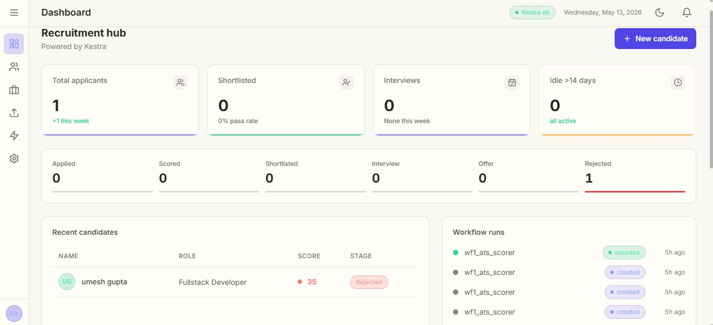
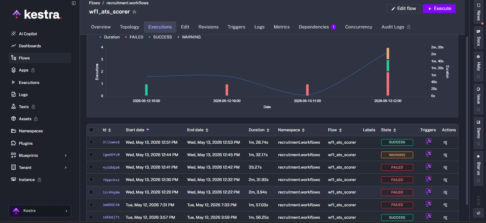
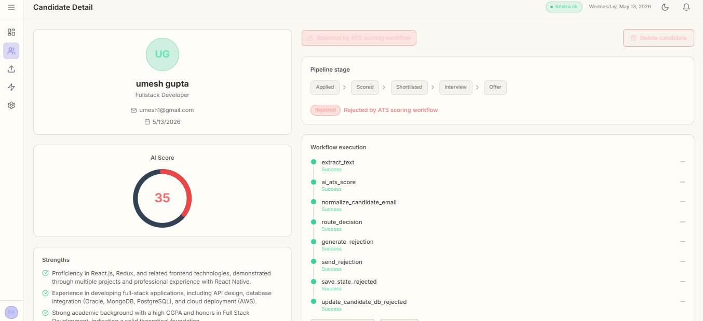
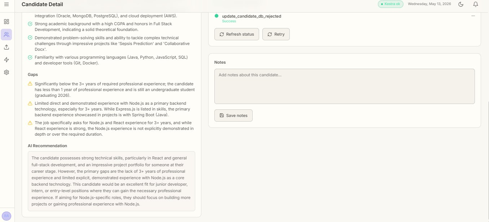

# Recruitment Automation Dashboard

A modern recruitment pipeline dashboard built with React + Express, powered by [Kestra](https://kestra.io) workflow orchestration.

   

## Screenshots

### Dashboard Overview

The main **Recruitment Hub** serves as the command center for the entire hiring pipeline. At a glance, recruiters can see the total number of applicants, how many have been shortlisted, upcoming interviews scheduled for the week, and any candidates who have been sitting idle for more than 14 days without a pipeline update. The lower half of the dashboard is split into two panels — the left shows a live candidate table with each person's name, applied role, AI-generated score, and current pipeline stage, while the right panel streams real-time Kestra workflow run statuses so you can immediately see whether a resume scoring job succeeded, is queued, or needs attention.

### Kestra Workflow Executions

This view inside the Kestra UI shows the full execution history of the `wf1_ats_scorer` workflow — the core automation that processes every uploaded resume. Each row represents a single execution triggered by a resume upload, showing its start time, end time, total duration, and final status (SUCCESS, WARNING, or FAILED). The timeline chart at the top visualises execution frequency and duration over time, making it easy to spot spikes in load or recurring failures. From here, developers and admins can drill into individual runs to inspect logs, replay failed executions, or audit exactly what happened at each workflow step.

### Candidate Detail — Profile & Workflow Steps

The Candidate Detail page gives recruiters a full picture of each applicant in one place. The left card shows the candidate's name, applied role, email, and application date. Below it, a circular gauge displays the AI-generated ATS score from 0 to 100, colour-coded to indicate fit level. On the right, the pipeline stage tracker shows exactly where the candidate currently sits — Applied, Scored, Shortlisted, Interview, or Offer — with a clear rejection indicator if the ATS workflow routed them out automatically. The workflow execution panel lists every step that ran during processing, from `extract_text` and `ai_ats_score` through to `route_decision`, `generate_rejection`, `send_rejection`, and `update_candidate_db_rejected`, each with a success or failure status, giving full transparency into how the automated decision was reached.

### Candidate Detail — AI Analysis & Notes

Scrolling further down the Candidate Detail page reveals the full AI-generated evaluation. The **Strengths** section highlights specific skills and experiences the candidate demonstrated that align well with the role — such as proficiency in React and full-stack frameworks, database integration experience, and academic achievements. The **Gaps** section then surfaces areas where the candidate falls short of the job requirements, with clear reasoning — for example, insufficient years of professional experience or limited demonstrated depth in a required technology. Finally, the **AI Recommendation** block provides a plain-English summary that a recruiter can act on immediately, explaining whether the candidate is a strong fit, a potential fit for a different level, or not suitable, along with specific suggestions for what would make them a stronger applicant. Recruiters can also write and save private internal notes on each candidate directly from this panel.

## Prerequisites

- **Node.js 18+** and **pnpm** installed
- **Docker** (for running Kestra OSS)

## 1. Start Kestra

```bash
docker run --pull=always --rm -it -p 8080:8080 --user=root \
  -v /var/run/docker.sock:/var/run/docker.sock \
  -v /tmp:/tmp \
  kestra/kestra:latest server local
```

Kestra UI will be available at [http://localhost:8080](http://localhost:8080)

## 2. Backend Setup

```bash
cd recruitment-ui/backend
pnpm install
node server.js
```

The API server starts on [http://localhost:3001](http://localhost:3001)

## 3. Frontend Setup

```bash
cd recruitment-ui/frontend
pnpm install
pnpm dev
```

The dashboard opens at [http://localhost:5173](http://localhost:5173)

## 4. Environment Variables

Create `backend/.env`:

```env
KESTRA_BASE=http://localhost:8080/api/v1
PORT=3001
```

## 5. How to Test

1. Open [http://localhost:5173](http://localhost:5173)
2. Navigate to **Upload** → upload a resume PDF
3. Watch the **Dashboard** update with the new candidate
4. Check the **Workflows** page for execution status
5. Click a candidate to view AI scoring results and advance pipeline stages

## Architecture

```
Browser (React :5173)
   │
   ├─ /api/* ──→ Vite proxy ──→ Express (:3001)
   │                                │
   │                                ├─ SQLite (local candidate DB)
   │                                │
   │                                └─ Kestra REST API (:8080)
   │                                      │
   │                                      └─ Workflow executions
```

## Tech Stack

| Layer    | Tech                                      |
| -------- | ----------------------------------------- |
| Frontend | React 18, Vite, Tailwind CSS 3, Recharts  |
| Backend  | Express.js, better-sqlite3, Multer, Axios |
| Orchestr | Kestra OSS                                |
| Icons    | Lucide React                              |
